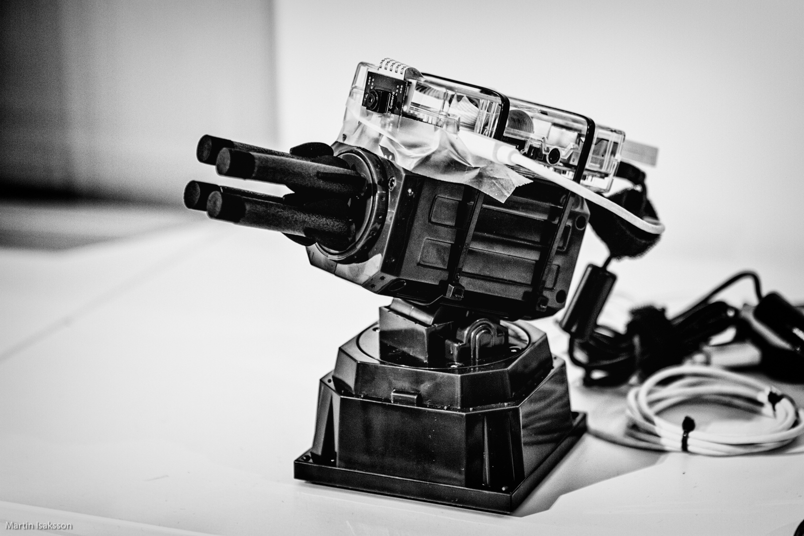
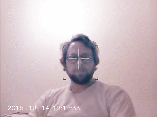

# Project Stingray

This is a face-tracking autonomous foam-missile launcher. It aims for your eyes - you have been warned! 





## Acknowledgements

There are many similar projects out there - here are a few that I found interesting. This project has been heavily influenced by these.

* [Basic motion detection and tracking with Python and OpenCV](http://www.pyimagesearch.com/2015/05/25/basic-motion-detection-and-tracking-with-python-and-opencv/)
* [Sentinel](https://github.com/AlexNisnevich/sentinel) by Alex Nisnevich.
* [RETALIATION - A Jenkins "Extreme Feedback" Contraption](https://github.com/codedance/Retaliation)

## Instructions 
### Parts

* [Raspberry Pi 2](https://www.raspberrypi.org/products/raspberry-pi-2-model-b/)
* A camera. I used the [Raspberry Pi Camera Module](https://www.raspberrypi.org/products/camera-module/)
* [Thunder USB Missile Launcher](http://dreamcheeky.com/thunder-missile-launcher)
* USB Hub (since the missile launcher draws more current than the Raspberry USB ports can supply.)

### Software and libraries

* Python 2.7
* [OpenCV 3.0](http://opencv.org/opencv-3-0.html)
* PyUSB 1.0.0b1
* numpy 1.6.2
* picamera 1.10

I recommend installing libraries in a virtual environment. For installing OpenCV 3.0 I recommend [this guide](http://www.pyimagesearch.com/2015/07/27/installing-opencv-3-0-for-both-python-2-7-and-python-3-on-your-raspberry-pi-2/).

### Configuration

There is one config file named `config.json` which looks like this (non-implemented parts removed for clarity):

```
{
	"camera": {
		"show_video": false,
		"save_video": true,
		"resolution": [640, 480],
		"fps": 32,
		"warmup_time": 1.5,
		"classifier": "/home/pi/opencv/data/haarcascades/haarcascade_frontalface_default.xml"
		},
	"launcher": {
		"aim_multiplier": 0.5,
		"fire_threshold": 10
	}
}
```

For a higher framerate, reduce resolution to 320x240. You might need to change the path to the classifier.

The `aim_multiplier` is meant to reduce the corrections so that it doesn't overcorrect and go past the target but rather converge more slowly on to the target. I would like to make a better control loop, but this works pretty well!

### Other things

* Make sure the pi user has access to the USB port. You could also run with sudo. 

```bash
pi@node3 ~ $ lsusb
Bus 001 Device 002: ID 0424:9514 Standard Microsystems Corp. 
Bus 001 Device 001: ID 1d6b:0002 Linux Foundation 2.0 root hub
Bus 001 Device 003: ID 0424:ec00 Standard Microsystems Corp. 
Bus 001 Device 008: ID 04d9:0022 Holtek Semiconductor, Inc. Portable Keyboard
Bus 001 Device 004: ID 2101:8500 ActionStar 
Bus 001 Device 005: ID 0bda:8176 Realtek Semiconductor Corp. RTL8188CUS 802.11n WLAN Adapter
Bus 001 Device 006: ID 2101:8501 ActionStar 
Bus 001 Device 007: ID 2123:1010  
```

So in my example, the missile launcher was connected to bus 1 as device 7.

```
pi@node3 ~ $ sudo chmod a+rw /dev/bus/usb/001/007
```

* If you are connecting the missile launcher directly to the Pi, then add `max_usb_current=1` to `/boot/config.txt` and reboot.  Check settings with `vcgencmd get_config int`.

## Todo

* Add code to compensate for targets further away
* Save video only when finding a target
* Capture video while slewing